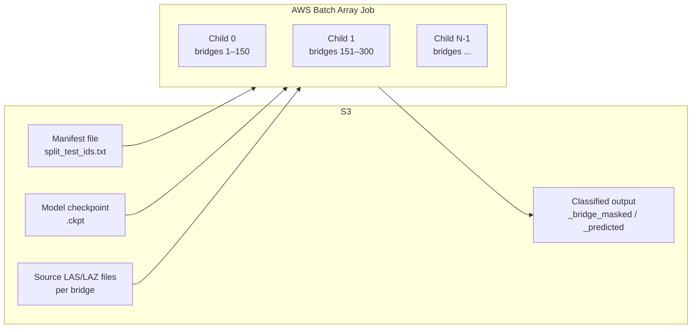

# AWS Batch Inference

Scale inference to thousands of millions of bridges in parallel using AWS Batch array jobs with SPOT instance support. Infrastructure is managed with Terraform; job submission, entrypoint, and post-run audit are Python scripts.

Each array child downloads the manifest and model, computes its chunk, then processes bridges one at a time: download → infer → upload → cleanup. Per-bridge upload with skip-if-exists makes SPOT interruption cheap (loses at most 1 in-progress bridge).

**Key files**:


| File                                 | Purpose                                                            |
| ------------------------------------ | ------------------------------------------------------------------ |
| `infra/terraform/bootstrap/`         | S3 bucket for Terraform remote state (once per account)            |
| `infra/terraform/foundation/`        | IAM roles + networking (VPC or reference existing)                 |
| `infra/terraform/app/`               | Workload: ECR, compute env, queue, job definition                  |
| `infra/terraform/app/terraform.tfvars` | All configurable values — gitignored; copy from `.tfvars.example`|
| `infra/terraform/app/terraform.tfvars.example` | Template with placeholder values for new setups          |
| `scripts/build_and_push.sh`          | Build Docker image and push to ECR                                 |
| `scripts/submit_batch_job.py`        | Submit single or array batch jobs                                  |
| `scripts/batch_entrypoint.py`        | Container entrypoint — per-bridge processing loop                  |
| `scripts/audit_outputs.py`           | Post-run verification — checks all expected outputs exist in S3    |
| `scripts/post_run_report.py`         | Post-run report — audit + CloudWatch aggregation + `_run_report.json` |
| `src/s3_client.py`                   | Generic S3 utilities (parse URIs, download/upload)                 |
| `src/s3_paths.py`                    | Bridge-specific S3 path resolution (manifest → S3 keys)           |
| `src/s3_audit.py`                    | Thread-pool S3 output auditor (used by audit_outputs and post_run_report) |


---

## Overview




Each child processes bridges **one at a time** in a loop:

1. Downloads the full manifest and model from S3
2. Computes its chunk of manifest lines based on `AWS_BATCH_JOB_ARRAY_INDEX` and `ARRAY_SIZE`
3. For each bridge in its chunk:
  - **Skip** if output already exists in S3 (resumability)
  - **Download** input LAS/LAZ from S3
  - **Infer** using `run_inference()` (model loaded once, reused for all bridges)
  - **Upload** output immediately to S3
  - **Cleanup** local files (O(1 bridge) disk usage, not O(chunk))

---

## Prerequisites

- AWS account with IAM permissions for Batch, ECR, S3
- [Terraform](https://developer.hashicorp.com/terraform/install) installed
- Docker installed (for building inference images)
- Python environment for management scripts (job submission, audit, reporting):
  - **Option A**: `conda env create -f environment-data.yaml && conda activate bridge-classify-data` (Linux only — contains platform-specific packages)
  - **Option B**: `pip install boto3` (minimal, cross-platform — sufficient for submit/audit/report)
- Trained model checkpoint uploaded to S3
- A manifest file listing bridges to process (one per line)

**Which environment for what:**

| Task | Environment |
|------|------------|
| Training / inference (GPU) | Docker (recommended) or `environment.yaml` |
| Data processing (CPU) | `environment-data.yaml` |
| Job submission, audit, reporting | `environment-data.yaml` or `pip install boto3` |
| Tests | `pip install -r requirements-test.txt` |

---

## AWS Profile Configuration

All scripts use `AWS_PROFILE` as the primary credential source. Set it to the account where infrastructure was deployed (Batch, ECR, CloudWatch):

```bash
export AWS_PROFILE=my-profile
```

**Single account** (infra and data in the same account) — this is all you need. Every script falls back to `AWS_PROFILE` for all AWS access.

**Cross-account** (S3 data in a different account than Batch infra) — pass `--profile` to specify the S3 data profile. `AWS_PROFILE` still controls Batch/ECR/CloudWatch access:

```bash
# Submit: Batch uses AWS_PROFILE, manifest is read via --profile
python scripts/submit_batch_job.py --manifest s3://... --profile data-account

# Report: S3 audit via --profile, CloudWatch via --batch-profile
python scripts/post_run_report.py --bucket ... --profile data-account --batch-profile infra-account
```

| Script | `AWS_PROFILE` | `--profile` | `--batch-profile` |
|--------|---------------|-------------|-------------------|
| `build_and_push.sh` | ECR login + push | — | — |
| `submit_batch_job.py` | Batch job submission | S3 manifest access (optional) | — |
| `audit_outputs.py` | — | S3 output checks | — |
| `post_run_report.py` | — | S3 audit | Batch/CloudWatch queries (optional) |

---

## Quick Start

### 1. Configure

Infrastructure is layered: `bootstrap` (state bucket) → `foundation` (IAM + networking) → `app` (workload). Bootstrap and foundation are applied once per account; day-to-day changes only touch `app`. See `infra/terraform/README.md` for the full layered apply guide.

Copy the app example and fill in your values (`terraform.tfvars` is gitignored):

```bash
cd infra/terraform/app
cp terraform.tfvars.example terraform.tfvars
```

Edit `terraform.tfvars` with foundation outputs (subnets, SG, role ARNs) and your S3 paths. Examples below use `my-bucket` as the bucket — replace with your own:

```hcl
# infra/terraform/app/terraform.tfvars

allowed_account_id = "123456789012"

# --- From foundation's `terraform output` ---
subnets                    = ["subnet-...", "subnet-..."]
batch_security_group_id    = "sg-..."
batch_job_role_arn         = "arn:aws:iam::123456789012:role/bridge-classifier-batch-job"
batch_instance_profile_arn = "arn:aws:iam::123456789012:instance-profile/bridge-classifier-batch-instance"
spot_fleet_role_arn        = "arn:aws:iam::123456789012:role/bridge-classifier-spot-fleet"
batch_service_role_arn     = "arn:aws:iam::123456789012:role/aws-service-role/batch.amazonaws.com/AWSServiceRoleForBatch"

# --- S3 / Inference config — change these for new runs ---
s3_bucket        = "my-bucket"
s3_input_prefix  = "bridge-classification/ml-data/source"
s3_manifest_uri  = "s3://my-bucket/bridge-classification/ml-data/split_test_ids.txt"
s3_model_uri     = "s3://my-bucket/path/to/your-model.ckpt"
s3_output_prefix = "scratch/your-name/predictions"

# Compute (optional tweaks)
# use_spot       = true             # ~60-70% cost savings (auto-retries on interruption)
# instance_types = ["g4dn.xlarge"]
# max_vcpus      = 256

# Inference runtime (defaults shown — override at submit time via --env if needed)
# inference_mode = "masked"         # "masked", "raw", or "both"
# bridge_timeout = 150              # per-bridge timeout in seconds
# retry_attempts = 3                # SPOT interruption retries
```

See [Configuration Reference](#configuration-reference) for all available options.

### 2. Deploy Infrastructure

First-time setup requires all three layers (see `infra/terraform/README.md`). For day-to-day config changes (S3 paths, instance types, etc.), only the app layer needs re-applying:

```bash
cd infra/terraform/app
terraform init -backend-config=backend.hcl   # first time only
terraform plan                                # preview changes
terraform apply                               # create/update resources
```

This creates: ECR repository, Batch compute environment, job queue, and job definition (with your S3 config baked into the job definition env vars).

### 3. Build and Push Docker Image

```bash
export AWS_PROFILE=my-profile
export AWS_REGION=us-east-1
chmod +x ./scripts/build_and_push.sh
./scripts/build_and_push.sh
```

Only needed when you change code (`src/`, `scripts/`, or `Dockerfile`). Changing S3 paths or inference config in `infra/terraform/app/terraform.tfvars` does **not** require a rebuild — those are environment variables in the job definition.

### 4. Submit a Job

```bash
# Dry run — shows array size, cost estimate, container overrides (does NOT submit)
python scripts/submit_batch_job.py \
    --manifest s3://my-bucket/bridge-classification/ml-data/split_test_ids.txt \
    --profile my-profile \
    --dry-run

# Submit array job from S3 manifest
python scripts/submit_batch_job.py \
    --manifest s3://my-bucket/bridge-classification/ml-data/split_test_ids.txt \
    --profile my-profile

# Override inference mode and output prefix for one run
python scripts/submit_batch_job.py \
    --manifest s3://my-bucket/bridge-classification/ml-data/split_test_ids.txt \
    --profile my-profile \
    --env INFERENCE_MODE=both \
    --env S3_OUTPUT_PREFIX=scratch/myfolder/bridge-classification-test/predictions

# Single job (no array, processes all bridges sequentially)
python scripts/submit_batch_job.py --single

# Validate manifest format before submitting
python scripts/submit_batch_job.py \
    --manifest s3://my-bucket/bridge-classification/ml-data/split_test_ids.txt \
    --profile my-profile \
    --validate
```

The `--profile` flag controls which AWS profile is used to read the manifest from S3 (for line counting).

Run tracking (`_run_config.json`) is saved automatically — `s3_bucket` and `s3_output_prefix` are read from terraform outputs. Override with `--bucket` and `--output-prefix` if needed, or via `--env S3_OUTPUT_PREFIX=...` for a different output path.

### 5. Monitor

The submit script prints a link to the Batch console. Logs are written to CloudWatch log group `/aws/batch/bridge-classifier` with structured fields for querying.

**Log format:** `[Child {idx}] [bridge={bridge_id}] EVENT key=value ...`

Example log lines:

```
[Child 42] [bridge=bridge_10598181] INFER_START (5/150) mode=masked huc=02050206 manifest_line=6305
[Child 42] [bridge=bridge_10598181] INFER_OK bridge_seconds=87.3s (5/150) huc=02050206
[Child 42] [bridge=bridge_5069009] SKIP_EXISTS (6/150) manifest_line=6306 huc=03070101
[Child 42] [bridge=bridge_9921003] INFER_FAILED reason=timeout bridge_timeout=150s huc=02050206 manifest_line=6307
[Child 42] [bridge=bridge_1234567] INFER_FAILED reason=inference_error huc=02050206 manifest_line=6308
[Child 42] [bridge=bridge_8888888] SKIP_SMALL_FILE points<100 huc=03070101 manifest_line=6309
[Child 42] SUMMARY succeeded=138 failed=3 skipped_exists=5 skipped_too_few_points=2 download_failed=2 total=150 wall_clock_seconds=14400 wall_clock_hours=4.0000
```

**CloudWatch Insights queries:**

```
# Find all failures with reason breakdown
fields @timestamp, @message
| filter @message like /INFER_FAILED/
| parse @message "reason=* " as reason
| sort @timestamp desc

# Failures by reason (timeout vs inference_error vs other)
fields @timestamp, @message
| filter @message like /INFER_FAILED/
| parse @message "reason=* " as reason
| stats count() by reason

# Find bridges skipped due to too few points
fields @timestamp, @message
| filter @message like /SKIP_SMALL_FILE/
| sort @timestamp desc

# Find OOM errors (GPU out of memory)
fields @timestamp, @message
| filter @message like /CUDA out of memory/ or @message like /OutOfMemoryError/
| sort @timestamp desc

# Average bridge processing time per child
fields @timestamp, @message
| filter @message like /INFER_OK/
| parse @message "bridge_seconds=*s" as seconds
| stats avg(seconds), max(seconds), count() by @logStream

# Summary across all children
fields @timestamp, @message
| filter @message like /SUMMARY/
| parse @message "succeeded=* failed=* skipped_exists=* skipped_too_few_points=* download_failed=*" as ok, fail, skip_exists, skip_few_pts, dl_fail
| stats sum(ok) as total_ok, sum(fail) as total_fail, sum(skip_exists) as total_skip_exists, sum(skip_few_pts) as total_skip_too_few_points, sum(dl_fail) as total_dl_fail

# All non-success events (quick triage)
fields @timestamp, @message
| filter @message like /FAILED/ or @message like /TIMEOUT/ or @message like /SKIP_SMALL/
| sort @timestamp desc
| limit 200
```

```bash
# Tail logs in terminal
aws logs tail /aws/batch/bridge-classifier --follow --profile my-profile

# List running jobs
aws batch list-jobs --job-queue bridge-classifier-inference-queue --job-status RUNNING --profile my-profile
```

### 6. Audit Outputs

After all children complete, verify that every expected output exists in S3:

```bash
# Check all outputs exist
python scripts/audit_outputs.py \
    --manifest s3://my-bucket/bridge-classification/ml-data/split_test_ids.txt \
    --bucket my-bucket \
    --input-prefix bridge-classification/ml-data/source \
    --output-prefix scratch/myfolder/bridge-classification-test/predictions \
    --mode masked \
    --profile my-profile

# Write missing entries to a file for re-submission
python scripts/audit_outputs.py \
    --manifest s3://my-bucket/bridge-classification/ml-data/split_test_ids.txt \
    --bucket my-bucket \
    --input-prefix bridge-classification/ml-data/source \
    --output-prefix scratch/myfolder/bridge-classification-test/predictions \
    --mode masked \
    --write-missing missing.txt \
    --profile my-profile

# Tune concurrency (default: 200 threads)
python scripts/audit_outputs.py ... --workers 100
```

If outputs are missing, upload the missing manifest and re-submit:

```bash
aws s3 cp missing.txt s3://my-bucket/bridge-classification/missing_manifest.txt --profile my-profile
python scripts/submit_batch_job.py \
    --manifest s3://my-bucket/bridge-classification/missing_manifest.txt \
    --profile my-profile
```

Re-submission is safe — skip-if-exists means already-completed bridges are skipped.

### 7. Post-Run Report

After all children complete, generate a comprehensive report with audit results, CloudWatch aggregation, and per-bridge timing:

```bash
python scripts/post_run_report.py \
    --bucket my-bucket \
    --output-prefix bridge-classification/runs/my-run/predictions \
    --mode masked \
    --profile my-profile \
    --batch-profile my-profile
```

Use `--batch-profile` when your S3 and Batch/CloudWatch credentials are on different AWS profiles.

This reads `_run_config.json` (saved at submission), audits S3 outputs, queries CloudWatch for SUMMARY and INFER_OK lines, queries failure reasons for missing bridges, and saves `_run_report.json` to the output prefix.

Use `--skip-timing` for a faster report without per-bridge p50/p95 stats.

### 8. Cleanup

To tear down all Batch infrastructure, destroy layers in reverse order:

```bash
cd infra/terraform/app && terraform destroy        # workload (ECR, Batch)
cd ../foundation && terraform destroy              # IAM roles + networking
cd ../bootstrap && terraform destroy               # state bucket (optional — safe to keep)
```

Destroying `app` alone is usually sufficient (removes ECR, compute env, queue, job def). Foundation and bootstrap are shared infrastructure rarely torn down. S3 data is not affected.

---

## How Chunking Works

The submit script computes how many array children to create:

```python
array_size = min(ceil(total / chunk_target), 10_000)  # capped at AWS Batch limit
```

- `chunk_target` defaults to 60 (files per container)
- `array_size` is capped at 10,000 (AWS Batch hard limit)

Each child computes its chunk at runtime from the actual manifest:

```python
chunk_size = ceil(total_lines / array_size)
start = job_index * chunk_size
end = min(start + chunk_size, total_lines)
```

Example with 1,500,000 bridges:


|                 | Value                             |
| --------------- | --------------------------------- |
| chunk_target    | 60 (requested)                    |
| array_size      | 10,000 (capped from ideal 25,000) |
| Files per child | ~150 (auto-adjusted)              |


When the array size is capped at 10K, the submit script reports: `Array size: 10000 (capped from ideal 25000; chunk_target=60 requested → actual ~150 per child)`.

The entrypoint re-counts the actual manifest, so chunk boundaries adapt even if `--total` was approximate.

---

## SPOT Instance Handling

Three layers of protection against SPOT interruption:

### 1. SIGTERM Handler (batch_entrypoint.py)

When AWS reclaims a SPOT instance, it sends SIGTERM with ~2 minutes before SIGKILL. The handler sets `shutdown_requested = True`, and the loop finishes the current bridge's full cycle (inference + upload) before exiting. No half-uploaded files.

### 2. Retry Strategy (Terraform)

The job definition includes `retry_strategy` that auto-retries on SPOT interruption (status reason `"Host EC2*"`) up to `retry_attempts` (default 3) times. Other failures (OOM, app errors) exit immediately — no wasted retries.

### 3. Skip-if-Exists (Resumability)

When a retried child starts, it checks S3 for each bridge's output before processing. Bridges completed before the interruption are skipped. A retry only processes the remaining bridges.

**Flow:** SPOT reclaim → SIGTERM → finish current bridge → child exits → Batch auto-retries → retried child skips completed bridges → continues.

---

## Inference Modes

Set via `inference_mode` in terraform or `--env INFERENCE_MODE=...` at submit time.


| Mode               | Output file(s)                                      | Description                                                                     |
| ------------------ | --------------------------------------------------- | ------------------------------------------------------------------------------- |
| `masked` (default) | `{stem}_bridge_masked.laz`                          | Bridge deck only (model class 2 → ASPRS 17) overlaid on original classification |
| `raw`              | `{stem}_predicted.laz`                              | All model classes mapped to ASPRS codes (replaces original classification)      |
| `both`             | `{stem}_predicted.laz` + `{stem}_bridge_masked.laz` | Both outputs per bridge                                                         |


Output files preserve the input extension (`.laz` or `.las`) and are organized by HUC:

```
s3://{bucket}/{output_prefix}/{huc_id}/{stem}_bridge_masked.laz
```

---

## Manifest File Format

One bridge per line. Extensionless or with extension:

```
02050206/bridge_10598181_USGS_LPC_PA_South_Central_B2_2017_LAS_2019
03070101/bridge_5069009_USGS_LPC_PA_South_Central_B2_2017_LAS_2019.laz
11010009/bridge_1234567_USGS_Some_Dataset.las
```

If a line has no extension, the entrypoint probes S3 for `.laz` first, then `.las` via `head_object`. .

The split manifest produced by `utils/split_data.py` (`split_test_ids.txt`) is directly usable.

---

## Configuration Reference

All variables are defined in `infra/terraform/app/variables.tf` with defaults. Override them in `infra/terraform/app/terraform.tfvars`. Set `AWS_PROFILE` in your environment (not in Terraform).

### AWS & General


| Variable             | Default             | Description                                |
| -------------------- | ------------------- | ------------------------------------------ |
| `allowed_account_id` | (required)          | 12-digit AWS account ID — safety guard     |
| `region`             | `us-east-1`         | AWS region                                 |
| `project_name`       | `bridge-classifier` | Prefix for all resource names              |


### IAM Roles (managed by the foundation layer)

Paste these from `cd infra/terraform/foundation && terraform output`:

| Variable                     | Description                                            |
| ---------------------------- | ------------------------------------------------------ |
| `batch_job_role_arn`         | IAM role for job containers (S3 read/write scoped to data bucket) |
| `batch_instance_profile_arn` | EC2 instance profile for compute instances             |
| `spot_fleet_role_arn`        | EC2 Spot Fleet role (only used when `use_spot = true`) |
| `batch_service_role_arn`     | AWS Batch service-linked role                          |


### Compute


| Variable         | Default           | Description                                       |
| ---------------- | ----------------- | ------------------------------------------------- |
| `instance_types` | `["g4dn.xlarge"]` | GPU instance type(s)                              |
| `max_vcpus`      | `256`             | Max vCPUs across all instances                    |
| `use_spot`       | `true`            | Use Spot instances (auto-retries on interruption) |


### Job Definition


| Variable              | Default | Description                                |
| --------------------- | ------- | ------------------------------------------ |
| `job_vcpus`           | `3`     | vCPUs per container                        |
| `job_memory`          | `15000` | Memory (MB) per container                  |
| `shared_memory_size`  | `4096`  | Shared memory (MB) for PyTorch/spconv      |
| `job_timeout_seconds` | `28800` | Max wall-clock seconds per child (8 hours) |


### S3 / Inference


| Variable           | Description                     |
| ------------------ | ------------------------------- |
| `s3_bucket`        | S3 bucket for all I/O           |
| `s3_input_prefix`  | Prefix for source LAS/LAZ files |
| `s3_manifest_uri`  | Full S3 URI of manifest         |
| `s3_model_uri`     | Full S3 URI of model checkpoint |
| `s3_output_prefix` | Where output files are uploaded |


### Inference Runtime


| Variable         | Default  | Description                                   |
| ---------------- | -------- | --------------------------------------------- |
| `inference_mode` | `masked` | Output mode: `masked`, `raw`, or `both`       |
| `bridge_timeout` | `150`    | Per-bridge timeout in seconds before skipping |
| `retry_attempts` | `3`      | SPOT interruption auto-retries                |


---

## Terraform Outputs

After `terraform apply`, these are available to scripts:

```bash
cd infra/terraform/app && terraform output
```


| Output                     | Description                             |
| -------------------------- | --------------------------------------- |
| `ecr_repository_url`       | ECR URL for `docker push`               |
| `job_definition_name`      | Batch job definition name               |
| `job_queue_name`           | Batch job queue name                    |
| `compute_environment_name` | Batch compute environment name          |
| `log_group_name`           | CloudWatch log group for Batch job logs |
| `s3_manifest_uri`          | S3 manifest URI (passthrough)           |
| `aws_region`               | AWS region (passthrough for scripts)    |


---

## Local Inference & Testing

### Direct Inference (no S3)

Use `src/inference.py` to run inference on local files without any S3 or Batch setup. The model is loaded once and reused for all files. Requires an NVIDIA GPU (spconv-cu120).

**Single file, masked mode** (default — bridge deck overlaid on original lidar):

```bash
python src/inference.py \
    --model ./experiments/bridge-base-all-data-v0/version_0/checkpoints/epoch=35.ckpt \
    --input ./data/ml-data/testing/02050206/bridge_10598181_USGS_LPC_PA_SouthCentral_B2_2017.laz \
    --output ./data/ml-data/predictions/bridge_10598181_bridge_masked.laz
```

**Single file, raw mode** (all model labels replace original classification):

```bash
python src/inference.py \
    --model ./experiments/bridge-base-all-data-v0/version_0/checkpoints/epoch=35.ckpt \
    --input ./data/ml-data/testing/02050206/bridge_10598181_USGS_LPC_PA_SouthCentral_B2_2017.laz \
    --output ./data/ml-data/predictions/bridge_10598181_predicted.laz \
    --mode raw
```

**Single file, both mode** (saves raw `_predicted` and masked `_bridge_masked` side by side):

```bash
python src/inference.py \
    --model ./experiments/bridge-base-all-data-v0/version_0/checkpoints/epoch=35.ckpt \
    --input ./data/ml-data/testing/02050206/bridge_10598181_USGS_LPC_PA_SouthCentral_B2_2017.laz \
    --output ./data/ml-data/predictions/bridge_10598181_predicted.laz \
    --mode both
```

With `--mode both`, the `--output` path receives the raw prediction (`_predicted.laz`) and a masked file (`_bridge_masked.laz`) is written alongside it in the same directory, deriving the name from the input file stem.

**Batch mode with pairs file** (process multiple files, model loaded once):

```bash
python src/inference.py \
    --model ./experiments/bridge-base-all-data-v0/version_0/checkpoints/epoch=35.ckpt \
    --pairs-file ./pairs.tsv \
    --mode masked
```

The pairs file is tab-separated with one input/output pair per line:

```
/path/to/input1.laz	/path/to/output1.laz
/path/to/input2.laz	/path/to/output2.laz
```

For large batches, use `--bridge-timeout` to skip bridges that hang (default: 150 seconds).

### Testing Batch Entrypoint Locally

Test the full S3-based entrypoint locally before submitting to Batch:

```bash
# Set env vars to simulate Batch
export AWS_PROFILE=Data
export S3_BUCKET=my-bucket
export S3_INPUT_PREFIX=bridge-classification/ml-data/source
export S3_MANIFEST_URI=s3://my-bucket/bridge-classification/test_manifest.txt
export S3_MODEL_URI=s3://my-bucket/bridge-classification/models/v3/epoch=35.ckpt
export S3_OUTPUT_PREFIX=scratch/your-name/predictions-test
export ARRAY_SIZE=1
export AWS_BATCH_JOB_ARRAY_INDEX=0
export INFERENCE_MODE=masked

python scripts/batch_entrypoint.py
```

---

## Cost Tracking

All Batch resources are tagged with `Project = bridge-classifier`. Tags propagate to the underlying ECS tasks via `propagate_tags = true` on the job definition.

**Cost Explorer:** Go to [AWS Cost Explorer](https://console.aws.amazon.com/cost-management/home#/cost-explorer), group by **Tag → Project**, and filter to `bridge-classifier`.

**Estimated costs** (printed by submit script with `--dry-run`):

- g4dn.xlarge SPOT: ~$0.234/hr per child (fluctuates — check https://aws.amazon.com/ec2/spot/pricing/)
- Example: 218K bridges at ~90s each, ~3,650 children: ~$1,275 compute + 20% buffer = ~$1,530

---

## Troubleshooting

**Job stuck in RUNNABLE**: Compute environment may not have capacity. Check that `max_vcpus` is sufficient and the instance type is available in your subnets/AZs.

**"Required environment variables not set" error**: The entrypoint validates that all S3 env vars are set. These come from the Terraform job definition. Run `cd infra/terraform/app && terraform apply` to ensure the job definition has all required env vars.

**Model loading errors**: Ensure the checkpoint was saved by `BridgeLightningModule` (Lightning format with `state_dict` key). The inference script handles both Lightning checkpoints and raw state dicts.

**GPU out of memory**: Large bridges with dense point clouds can exceed GPU memory. Use a larger instance or increase `--voxel-size` (coarser voxels = fewer voxels = less memory).

**S3 permission denied**: The Batch job IAM role is managed by the foundation layer and scoped to the `data_bucket`. Verify that `s3_bucket` in the app tfvars matches `data_bucket` in the foundation tfvars.

**SPOT instance interruptions**: The job definition auto-retries up to `retry_attempts` times on SPOT interruption. Combined with skip-if-exists, retries are cheap. For critical runs with no tolerance for delay, set `use_spot = false`.

**Per-bridge timeout (`INFER_FAILED reason=timeout` in logs)**: A bridge exceeded `bridge_timeout` seconds during inference. Usually caused by very large point clouds. Increase `bridge_timeout` in `infra/terraform/app/terraform.tfvars` or via `--env BRIDGE_TIMEOUT=300` at submit time.

**S3 throttling (503 SlowDown)**: The S3 client uses adaptive retry (3 attempts). If you see persistent throttling, your request rate may exceed the prefix partition limit. Input files distributed across HUC prefixes naturally mitigate this.

**Audit shows missing outputs**: Re-submit with the missing manifest. Skip-if-exists ensures already-completed bridges are not reprocessed. Repeat audit → re-submit until all outputs are present.